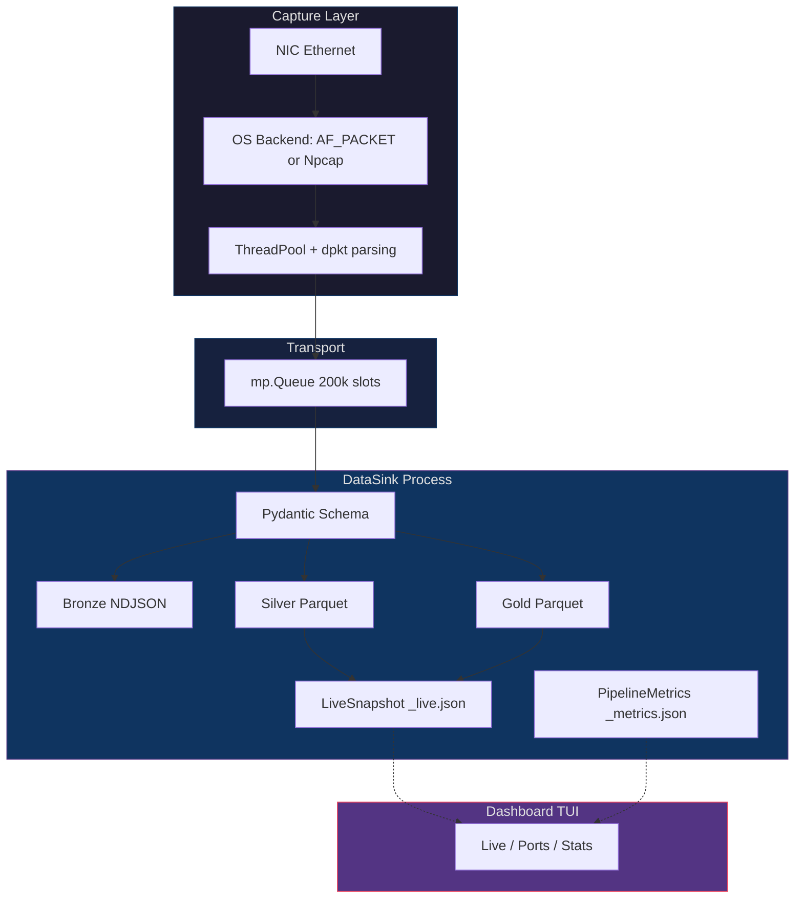
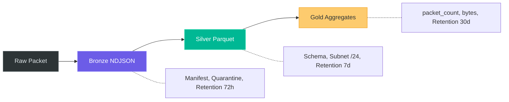
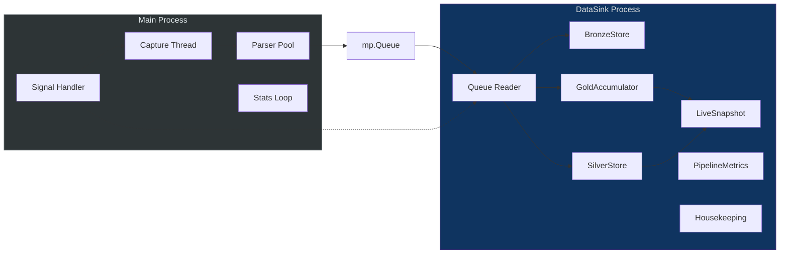
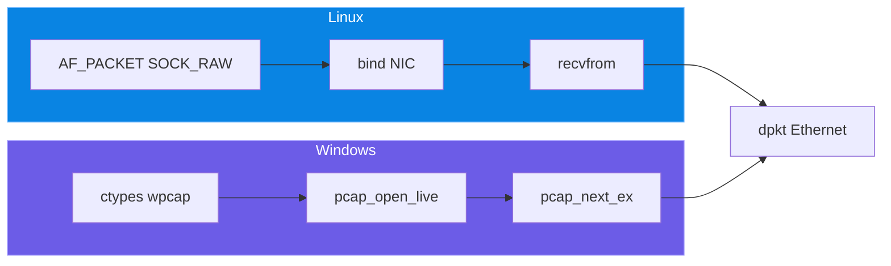
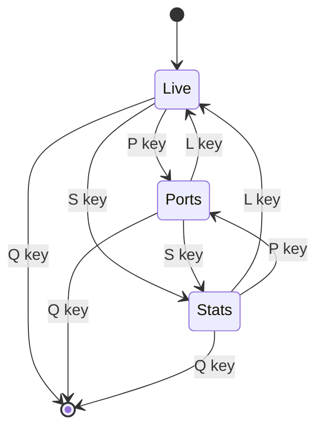
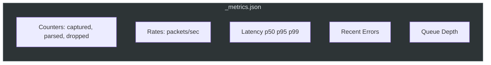
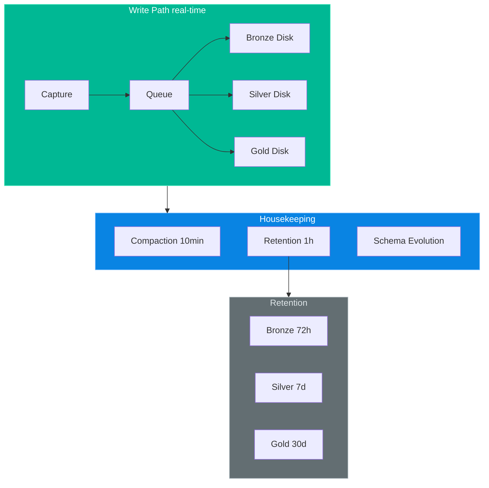
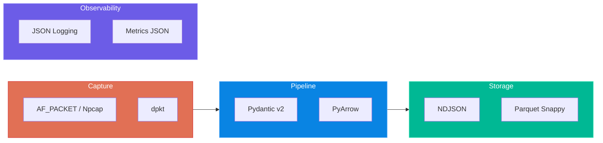
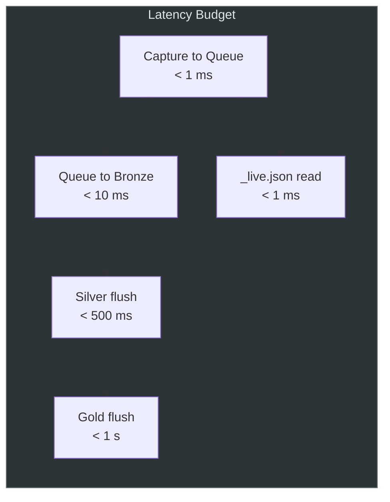
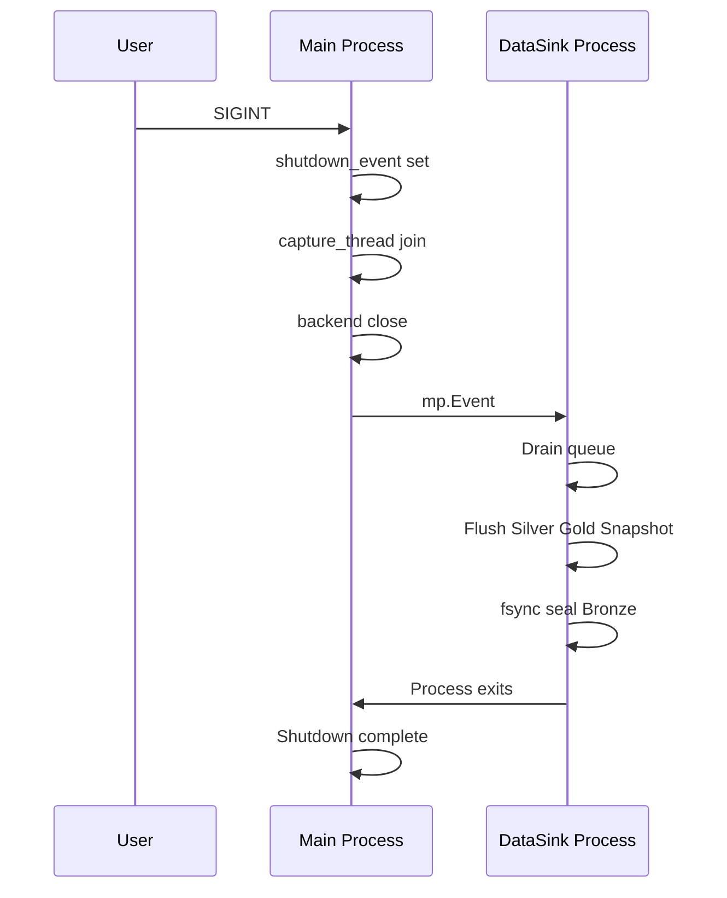

# Network Analytics Platform

[](https://www.python.org/downloads/)
[](https://docs.microsoft.com/windows)
[](https://github.com/kbandla/dpkt)
[](https://arrow.apache.org/docs/python/)
[](https://docs.pydantic.dev/)
[](https://fastapi.tiangolo.com/)
[](https://docs.pytest.org/)

> Real-time network traffic capture and analysis on a single edge node.  
> Medallion architecture (Bronze / Silver / Gold), sub-second latency, zero JVM dependency.

---

## Architecture Overview



---

## Medallion Data Flow

Each packet traverses all three layers **in the same loop tick** — no intermediate file reads between layers.



---

## Launch / Run

Lancer depuis la **racine du projet** (où se trouvent `run.py`, `src/`, `requirements.txt`). Activer le venv avant toute commande.

---

### Windows

| Méthode | Commande / démarche | Rôle |
|--------|----------------------|------|
| **1. Bootstrap** | `.\setup.ps1` (PowerShell en admin) | Crée `.venv`, installe les dépendances. |
| **2. Script Python (tout-en-un)** | `.\.venv\Scripts\Activate.ps1` puis `python run.py` | Capture + pipeline + **TUI** (terminal). Lance en admin si nécessaire (Npcap). *Ne lance pas l’interface web.* |
| **2b. Script Python (sans TUI)** | `python run.py --no-dashboard` | Capture + pipeline uniquement ; utile si l’UI est la web. |
| **3. Exécutable .exe** | Lancer le binaire PyInstaller (ex. `networkInterface.exe`) en admin | Même stack que le script ; un seul processus. |
| **4. Interface web** | `python -m src.network_interface.web.web_main` | **Pour l’UI navigateur** : démarre la capture si `_live.json` absent ou périmé, puis sert l’UI sur `http://127.0.0.1:8000`. |
| **5. Composants seuls** | `python -m network_interface.capture.capture_agent` (capture seule) ; `python -m network_interface.monitoring.dashboard` (TUI seul, lit `_live.json`) | Pour debug ou déploiement découplé. |

Fichiers produits à la **racine du projet** (répertoire qui contient `run.py` et `src/`) : `_live.json`, `_metrics.json`, `_metrics_capture.json`, dossiers `bronze/`, `silver/`, `gold/`. **`_live.json`** n’est jamais ailleurs : c’est toujours ce dossier (défini par `NI_PROJECT_ROOT` ou par le chemin du projet).

---

### Linux / macOS

| Méthode | Commande / démarche | Rôle |
|--------|----------------------|------|
| **1. Bootstrap** | `./setup.sh` | Crée `.venv`, installe les dépendances. |
| **2. Script Python (tout-en-un)** | `sudo python run.py` ou, avec venv, `sudo .venv/bin/python run.py` | Capture (droits raw) + pipeline + TUI. |
| **2b. Script Python (sans TUI)** | `sudo python run.py --no-dashboard` | Capture + pipeline uniquement. |
| **3. Interface web** | `python -m src.network_interface.web.web_main` (après activation du venv) | Idem Windows : démarre la capture si besoin, puis UI sur `http://127.0.0.1:8000`. |
| **4. Composants seuls** | `sudo python -m network_interface.capture.capture_agent` ; `python -m network_interface.monitoring.dashboard` | Capture en root/cap_net_raw ; TUI en user. |

Même emplacement des sorties : racine du projet (`_live.json`, `_metrics*.json`, `bronze/`, `silver/`, `gold/`).

---

### Emplacement des données (état du projet)

Tous les chemins sont résolus par rapport à la **racine du projet** (dossier contenant `src/` et `run.py`) :

- **`_live.json`** : snapshot live (capture + web lisent/écrivent ce fichier à la racine).
- **`_metrics_capture.json`**, **`_metrics.json`** : métriques pipeline.
- **`bronze/`**, **`silver/`, `gold/`** : données medallion.

Lancer **toujours depuis la racine** (ex. `python run.py` ou `python -m src.network_interface.web.web_main`). Si une ancienne copie de `_live.json` existait ailleurs (ex. dans `src/`), la supprimer pour éviter de lire des données périmées.

---

### Tests

Depuis la racine du projet, venv activé :

```bash
python -m pytest tests/ -v
```

---

## Process Architecture



### GIL Bypass Strategy

| Stage | Thread/Process | Why GIL is not a bottleneck |
|---|---|---|
| **Capture** | Dedicated thread | `recvfrom()` / `pcap_next_ex()` are C calls — GIL released |
| **Parsing** | ThreadPool (N workers) | `dpkt` uses `struct.unpack()` — C extension, GIL released |
| **I/O Sink** | Dedicated OS process | Own interpreter, own GIL — zero contention |

---

## Capture Backends



| Feature | Linux | Windows |
|---|---|---|
| Mechanism | Kernel-native `AF_PACKET` | Npcap `wpcap.dll` via `ctypes` |
| Device resolution | Direct NIC name | Registry GUID lookup |
| Privileges | `CAP_NET_RAW` or root | Administrator |
| Promiscuous mode | Supported | Enabled by default |

---

## Dashboard TUI

Three modal views, all fitted to terminal height. Switch with hotkeys or CLI subcommands.



| View | Hotkey | Content |
|---|---|---|
| **Live** | `L` | htop-style scrolling packet table (newest at bottom) |
| **Ports** | `P` | Port/service breakdown with protocol, packets, bytes, distribution bar |
| **Stats** | `S` | Protocol split, top source/dest IPs, subnets, Gold hourly aggregates |

**Data source**: `_live.json` — an atomic JSON sidecar written every 300ms by the capture agent. Dashboard read time: **< 1ms**.

---

## Observability

### Structured Logging (`structured_log.py`)

Every log line is a JSON object, ready for Splunk HEC / ELK / Loki:

```json
{
  "ts": "2026-02-25T14:32:01.123456+00:00",
  "level": "INFO",
  "logger": "capture_agent",
  "msg": "Stats | seen=45000 queued=44800 q_size=12",
  "correlation": "a1b2c3d4e5f6",
  "agent_id": "a1b2c3d4e5f6",
  "pid": 12345,
  "thread": "MainThread"
}
```

Log files: `capture.log` (main process), `pipeline.log` (DataSink process).

### Pipeline Metrics (`pipeline_metrics.py`)

`_metrics.json` is atomically written every 2 seconds:



---

## Data Lifecycle



### Schema Evolution

Old Parquet files remain readable after schema changes:

| Scenario | Handling |
|---|---|
| New column added | Filled with typed nulls |
| Column removed | Dropped silently |
| Type changed | Safe cast, or null fallback |

Powered by `_coerce_schema()` — applied at compaction and at read time via `read_parquet_with_evolution()`.

---

## Project Structure

```
networkInterface/
├── capture_agent.py          # Capture engine + DataSinkProcess (Bronze/Silver/Gold)
├── streaming_pipeline.py     # Silver/Gold transforms, stores, compaction, retention
├── bronze_store.py           # Bronze layer (partition, manifest, rotation, quarantine)
├── structured_log.py         # JSON structured logging (Splunk/ELK/Loki ready)
├── pipeline_metrics.py       # Real-time metrics (_metrics.json)
├── dashboard.py              # htop-style TUI (Live/Ports/Stats views)
├── run.py                    # Unified launcher (capture + dashboard)
├── databricks_pipeline.py    # Local Parquet reader + Cloud Spark pipeline
├── requirements.txt
├── pytest.ini
│
├── tests/                    # 62 tests, <1s execution
│   ├── test_silver_transform.py
│   ├── test_stores.py
│   ├── test_bronze_store.py
│   ├── test_packet_parser.py
│   ├── test_pipeline_integration.py
│   ├── test_compaction_retention.py
│   └── test_structured_logging.py
│
├── setup.ps1                 # Windows bootstrap
├── setup.sh                  # Linux bootstrap
├── run.cmd                   # Windows shortcut
│
├── bronze/                   # [generated] Raw packet NDJSON
│   ├── data/dt=YYYY-MM-DD/hr=HH/*.ndjson
│   ├── _manifest/manifest.jsonl
│   ├── _quarantine/
│   └── _meta/agent.json
│
├── silver/                   # [generated] Cleaned Parquet
│   └── event_date=YYYY-MM-DD/*.parquet
│
├── gold/                     # [generated] Aggregated Parquet
│   └── event_date=YYYY-MM-DD/*.parquet
│
├── _live.json                # [generated] Dashboard snapshot (300ms refresh)
└── _metrics.json             # [generated] Pipeline health metrics (2s refresh)
```

---

## Technology Stack



| Layer | Technology | Role |
|---|---|---|
| Capture (Linux) | **AF_PACKET** raw socket | Kernel-native, zero-copy, GIL released |
| Capture (Windows) | **Npcap** via `ctypes` | Direct C binding to `wpcap.dll` |
| Parsing | **dpkt** + `ThreadPoolExecutor` | Struct-based, 130x faster than Scapy |
| I/O Sink | **multiprocessing.Process** | Dedicated process, bypasses GIL |
| Validation | **Pydantic v2** | Schema enforcement on every record |
| NIC Detection | **psutil** | Auto-detect most-active NIC |
| Bronze | **NDJSON** | Partitioned, manifest-tracked, compacted |
| Silver / Gold | **PyArrow** Parquet | In-memory transform + columnar writes |
| Logging | **JSON structured** | Splunk / ELK / Loki compatible |
| Metrics | **Atomic JSON** | packets/sec, latency p50/p95/p99, queue depth |
| Tests | **pytest** | 62 tests, < 1 second |
| Cloud (optional) | **PySpark** + **Delta Lake** | Auto Loader on Databricks |

---

## Dependencies

### Edge Agent & Pipeline (local, no JVM)

| Package | Version | Role |
|---------|---------|------|
| `dpkt` | `>=1.9.8` | Ethernet/IP/TCP/UDP parsing |
| `pydantic` | `>=2.10.0` | Record schema validation |
| `psutil` | `>=6.1.0` | NIC detection |
| `pyarrow` | `>=15.0.0` | Silver/Gold Parquet I/O |
| `fastapi` | `>=0.115.0` | Web UI API |
| `uvicorn` | `>=0.30.0` | ASGI server |
| `jinja2` | `>=3.1.0` | Web UI templates |

### Tests

| Package | Version |
|---------|---------|
| `pytest` | `>=8.0.0` |
| `hypothesis` | `>=6.0.0` |
| `httpx` | `>=0.27.0` |

### System Prerequisites

| Component | OS | Notes |
|-----------|-----|------|
| **Npcap** | Windows | [npcap.com](https://npcap.com/#download) — WinPcap API-compatible mode |
| **Root / CAP_NET_RAW** | Linux | Required for AF_PACKET raw socket |

---

## Data Schemas

### Bronze (NDJSON)

```json
{
  "timestamp": "2026-02-25T14:32:01.123456+00:00",
  "src_ip": "192.168.1.42",
  "dst_ip": "142.250.74.206",
  "src_port": 54321,
  "dst_port": 443,
  "protocol": "TCP",
  "length": 1420,
  "ttl": 64,
  "flags": "PA",
  "agent_id": "a1b2c3d4e5f6"
}
```

### Silver (Parquet)

| Column | Type | Source |
|---|---|---|
| `event_ts` | `TIMESTAMP(us, UTC)` | Parsed from `timestamp` |
| `event_hour` | `TIMESTAMP(us, UTC)` | Truncated to hour |
| `event_date` | `DATE32` | Partition key |
| `src_ip` | `STRING` | Passthrough |
| `dst_ip` | `STRING` | Passthrough |
| `src_port` | `INT32` | Passthrough |
| `dst_port` | `INT32` | Passthrough |
| `protocol` | `STRING` | Uppercased |
| `length` | `INT64` | Passthrough |
| `ttl` | `INT32` | Passthrough |
| `flags` | `STRING` | Passthrough |
| `agent_id` | `STRING` | Passthrough |
| `ingested_at` | `TIMESTAMP(us, UTC)` | Pipeline ingestion time |
| `src_network` | `STRING` | CIDR /24 (`192.168.1.0/24`) |

### Gold (Parquet — hourly aggregates)

| Column | Type |
|---|---|
| `event_hour` | `TIMESTAMP(us, UTC)` |
| `event_date` | `DATE32` — partition key |
| `protocol` | `STRING` |
| `src_network` | `STRING` |
| `agent_id` | `STRING` |
| `packet_count` | `INT64` |
| `total_bytes` | `INT64` |
| `avg_packet_size` | `FLOAT64` |
| `first_seen` | `TIMESTAMP(us, UTC)` |
| `last_seen` | `TIMESTAMP(us, UTC)` |
| `unique_src_ips` | `INT64` |
| `unique_dst_ips` | `INT64` |
| `unique_dst_ports` | `INT64` |
| `computed_at` | `TIMESTAMP(us, UTC)` |

---

## Latency Targets



| Stage | Target | Mechanism |
|---|---|---|
| Capture -> Queue | **< 1 ms** | OS-native recv + `put_nowait` |
| Queue -> Bronze disk | **< 10 ms** | Buffered NDJSON write |
| Queue -> Silver disk | **< 500 ms** | In-memory transform + PyArrow flush (500 records or 0.5s) |
| Queue -> Gold disk | **< 1 s** | In-memory accumulation + PyArrow flush (1s) |
| Dashboard data load | **< 1 ms** | Atomic JSON read (`_live.json`) |

---

## Design Decisions

### Why inline streaming instead of Spark local?

| Concern | Spark batch | Inline streaming |
|---|---|---|
| Latency | 5-30s (JVM startup + planning) | **< 1 second** |
| Layer transport | File-based (write, seal, re-read) | **In-memory** (same process, same tick) |
| JVM dependency | Required (Java 11+) | **None** |
| Memory overhead | ~500 MiB (Spark driver) | **~50 MiB** (Python + PyArrow) |

### Why dpkt instead of Scapy?

| Metric | Scapy | dpkt |
|---|---|---|
| Parse 100k packets | 29.9 sec | **0.23 sec** (130x) |
| RAM for 100k packets | 678.9 MiB | **19.7 MiB** (34x) |
| Dependencies | ~15 packages | 0 (standalone) |

### Crash Safety



---

## Tests

62 tests covering all pipeline components. Execution time: **< 1 second**.

```bash
python -m pytest tests/ -v
```

| Test File | Tests | Coverage |
|---|---|---|
| `test_silver_transform.py` | 13 | Quality gate, timestamps, subnets, defaults |
| `test_stores.py` | 10 | SilverStore, GoldAccumulator, LiveSnapshot |
| `test_bronze_store.py` | 7 | Write, rotation, quarantine, manifest |
| `test_packet_parser.py` | 7 | dpkt TCP/UDP parsing, flags, edge cases |
| `test_compaction_retention.py` | 8 | Parquet compaction, schema evolution, retention |
| `test_structured_logging.py` | 8 | JSON formatter, correlation ID, metrics |
| `test_pipeline_integration.py` | 2 | End-to-end Bronze -> Silver -> Gold -> Snapshot |

---

## License

Internal project — not distributed.
